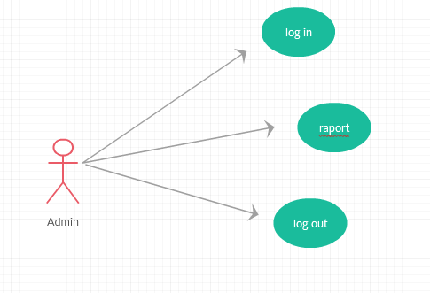

# Analysis and Design Document

# Requirement analysis

## Assignment Specification
 Use JAVA/C# API to design and implement an application for the front desk employees of a bank. The application should have two types of users (a regular user represented by the front desk employee and an administrator user) which have to provide a username and a password in order to use the application.
 
The regular user can perform the following operations:
*	Add/update/view client information (name, identity card number, personal numerical code, address, etc.).
*	Create/update/delete/view client account (account information: identification number, type, amount of money, date of creation).
*	Transfer money between accounts.
*	Process utilities bills.

   The administrator user can perform the following operations:
*	CRUD on employees’ information.
*	Generate reports for a particular period containing the activities performed by an employee.

## Function requirements
The data will be stored in a database. Use the Layers architectural pattern to organize your application.

## Non-functional Requirements
Availability: application is a desktop one and it’s always available in offline mode even if computer is running on low resources.
Extensibility:  adding features, and carry-forward of customizations at next major version upgrade it’s easy because using the layers architectural pattern the upgrade affects only some layers, not the entire application. 
Maintainability: this application it’s easy to maintain because components are easy to access and because we used layers arhitectural pattern we do not need to modify all the clases from the application.
Platform compatibility: the application runs on every computer that has a Java Runtime Environment installed.  
Portability: As I explained at the platform compatibility section this application is portable on every computer that has a JRE  installed. It runs on Windows and Ubuntu.
Security: The users must have an account created by the administrator otherwise they can not use the application. Only the employees of bank and administrator ca have an account.

# Use-Case Model

## Use case 1

   * **Use case**: Insert new client
    * Level: user-goal level
    * Primary actor: Bank Employee
    * Main success scenario: 
        * log in : write the username and password and push the log in button
        * insert in the client text flieds the client id (this could be any number because the data base auto increments the id), the cient name, IC series and number, adress and phone number
        * push the the insert button
        * optionaly push view button to see that the client was iserted in the data base and push the log out button
    * Extensions:
        * the employee could not have an account when he tries to log in, a fail message is shown
        * the client already is in the data base, a fail message is shown

## Use case 2

   * **Use case**:inser an account
    * Level:  user-goal level
    * Primary actor: bank employee
    * Main success scenario:
         * log in : write the username and password and push the log in button
         * insert in the account text flieds the user id (this could be any number because the data base auto increments the id), an id of a client that is in the client tabel,type (1-credit, 2- debit, 3 utilities).
         * push the the insert button
         * optionaly push view button to see that the client was iserted in the data base and push the log out button
    * Extensions: 
         * the client that should have that account do not exists, so the employee must add that client
         * the account already exists, so a fail message is shown
         
 

## Use case 3

   * **Use case** Generate raport
    * Level:  user-goal level
    * Primary actor: Administrator
    * Main success scenario:  
         * log in : write the username and password and push the log in button
         * insert in the under the username the name of the user about you want to get a raport and the date under the format DD/MM/YYYY
    * Extensions: the user do not exist,so a fail message is shown.
    
  

# System Architectural Design

## Architectural Pattern Description

   Layered architecture focuses on the grouping of related functionality within an application into distinct layers that are stacked vertically on top of each other. Functionality within each layer is related by a common role or responsibility. Communication between layers is explicit and loosely coupled. Layering your application appropriately helps to support a strong separation of concerns that, in turn, supports flexibility and maintainability.
The layered architectural style has been described as an inverted pyramid of reuse where each layer aggregates the responsibilities and abstractions of the layer directly beneath it. With strict layering, components in one layer can interact only with components in the same layer or with components from the layer directly below it. More relaxed layering allows components in a layer to interact with components in the same layer or with components in any lower layer.

## Diagrams

  ### Package Diagrams
  

 ### The Deployment Diagram
 

### The Component Diagram 

# UML Sequence Diagrams
The scenario: log in as an Administrator.

## UML Class Diagram
Create the UML Class Diagram and highlight and motivate how the design patterns are used.

# Data Model

# Bibliography
 * [Qnline diagram drawing software](https://www.draw.io)
 * [O'Reilly Layer Architecture](https://www.oreilly.com/ideas/software-architecture-patterns/page/2/layered-architecture)
 * [SQL Tutorial](https://www.w3schools.com/sql/)
